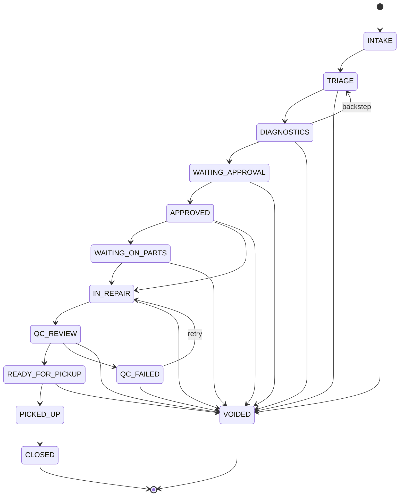

import InteractiveStateMachine from '../../../components/InteractiveStateMachine.astro';

Every repair ticket in RepairOps follows a defined state machine. This page documents every status, the allowed transitions between them, which roles can perform each transition, and the gate requirements that must be satisfied before leaving certain statuses.

## Interactive State Diagram

Click any status node to see its details, allowed transitions, permitted roles, and gate requirements. Gated statuses have dashed borders and an amber dot.

<InteractiveStateMachine />

## Statuses

RepairOps defines 13 ticket statuses. Every ticket starts at INTAKE and ends at CLOSED or VOIDED.

| # | Status | Description |
|---|--------|-------------|
| 1 | INTAKE | Ticket created, awaiting initial data collection |
| 2 | TRIAGE | Manager reviews and assigns tech |
| 3 | DIAGNOSTICS | Tech investigates the issue |
| 4 | WAITING_APPROVAL | Quote sent, awaiting customer approval |
| 5 | APPROVED | Customer approved the quote |
| 6 | WAITING_ON_PARTS | Parts ordered, waiting for delivery |
| 7 | IN_REPAIR | Active repair in progress |
| 8 | QC_REVIEW | Quality check before release |
| 9 | QC_FAILED | QC found issues, returns to repair |
| 10 | READY_FOR_PICKUP | Repair complete, awaiting customer |
| 11 | PICKED_UP | Customer collected the device |
| 12 | CLOSED | Final state — ticket complete |
| 13 | VOIDED | Cancelled at any stage |

## State Diagram (Mermaid)

The following diagram shows every valid transition. Dashed lines indicate backsteps and retries.

## Permission Matrix

Not every role can trigger every transition. The table below shows which roles are allowed to move a ticket **into** each target status.

| Target Status | OWNER | MANAGER | FRONT_DESK | TECH | QC | ACCOUNTING | DISPATCHER |
|---------------|:-----:|:-------:|:----------:|:----:|:--:|:----------:|:----------:|
| INTAKE | ✓ | ✓ | ✓ | | | | |
| TRIAGE | ✓ | ✓ | | | | | |
| DIAGNOSTICS | ✓ | ✓ | | ✓ | | | |
| WAITING_APPROVAL | ✓ | ✓ | ✓ | ✓ | | | |
| APPROVED | ✓ | ✓ | ✓ | | | | |
| WAITING_ON_PARTS | ✓ | ✓ | | ✓ | | | |
| IN_REPAIR | ✓ | ✓ | | ✓ | | | |
| QC_REVIEW | ✓ | ✓ | | ✓ | ✓ | | |
| QC_FAILED | ✓ | ✓ | | | ✓ | | |
| READY_FOR_PICKUP | ✓ | ✓ | ✓ | | | | |
| PICKED_UP | ✓ | ✓ | ✓ | | | | |
| CLOSED | ✓ | ✓ | ✓ | | | | |
| VOIDED | ✓ | ✓ | | | | | |

**OWNER** and **MANAGER** can perform any transition. Other roles are limited to transitions relevant to their responsibilities.

## Gate Requirements

Certain statuses have **exit gates** — conditions that must be met before a ticket can leave that status. Gates enforce data quality and ensure no ticket moves forward with incomplete information.

| Gate (Exit From) | Required Fields | Description |
|-----------------|-----------------|-------------|
| INTAKE | customer_id, device_identifier, issue_category, consent_signed, photos_min_2 | Basic intake data must be collected before triage |
| DIAGNOSTICS | diagnostic_checklist_complete, findings_summary, evidence_attachments_min_1 | Diagnostic results must be documented with evidence |
| WAITING_APPROVAL | quote_total, line_items, approval_link_sent | Quote must be prepared and sent to the customer |
| QC_REVIEW | qc_checklist_complete, verification_evidence_min_1, qc_outcome | QC must be completed with evidence and a pass/fail outcome |

:::note
Gates are **exit gates** — they are checked when leaving a gated status. Transitioning to VOIDED always bypasses gates, allowing tickets to be cancelled at any stage regardless of incomplete data.
:::

## Error Codes

When a transition fails, the API returns one of the following error codes.

| Code | Meaning |
|------|---------|
| `INVALID_TRANSITION` | The from-to transition is not in the state graph. For example, you cannot go directly from INTAKE to IN_REPAIR. |
| `PERMISSION_DENIED` | The user's role cannot move tickets to the target status. Check the permission matrix above. |
| `GATE_NOT_MET` | The exit gate for the current status has unmet requirements. Complete the required fields before transitioning. |
| `CONFLICT` | The ticket's current status does not match the `expectedStatus` parameter. This means another user changed the ticket since you last loaded it (optimistic concurrency check). Reload the ticket and try again. |

## How Transitions Work

All ticket status changes flow through a single code path:

1. **Client** calls the `transitionTicket` server action with `ticketId`, `newStatus`, and `expectedStatus`.
2. **Server Action** validates the user's role and checks permissions.
3. **Postgres function** `transition_ticket()` atomically validates the transition graph, checks gates, and updates the status.
4. A `ticket_events` row is created to record the transition in the audit trail.
5. Outbox events fire to trigger notifications (SMS, email, push) based on the new status.

This architecture ensures that no ticket can ever reach an invalid state, even under concurrent access.
