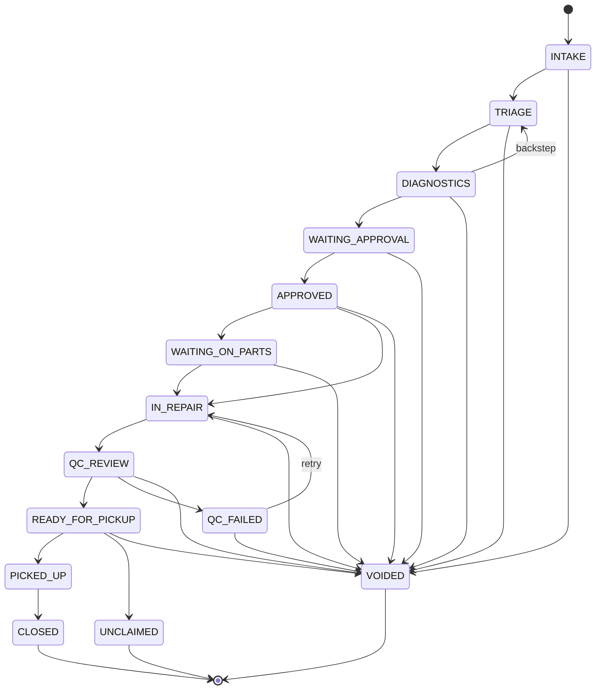

import InteractiveStateMachine from '../../../components/InteractiveStateMachine.astro';

Every repair ticket in RepairOps follows a defined state machine. This page documents every status, the allowed transitions between them, which roles can perform each transition, and the gate requirements that must be satisfied before leaving certain statuses.

## Interactive State Diagram

Click any status node to see its details, allowed transitions, permitted roles, and gate requirements. Gated statuses have dashed borders and an amber dot.

<InteractiveStateMachine />

## Statuses

RepairOps defines 14 ticket statuses. Every ticket starts at INTAKE and ends in one of three
terminal states: CLOSED, UNCLAIMED, or VOIDED.

| # | Status | Description |
|---|--------|-------------|
| 1 | INTAKE | Ticket created, awaiting initial data collection |
| 2 | TRIAGE | Manager reviews and assigns tech |
| 3 | DIAGNOSTICS | Tech investigates the issue |
| 4 | WAITING_APPROVAL | Quote sent, awaiting customer approval |
| 5 | APPROVED | Customer approved the quote |
| 6 | WAITING_ON_PARTS | Parts ordered, waiting for delivery |
| 7 | IN_REPAIR | Active repair in progress |
| 8 | QC_REVIEW | Quality check before release |
| 9 | QC_FAILED | QC found issues, returns to repair |
| 10 | READY_FOR_PICKUP | Repair complete, awaiting customer |
| 11 | PICKED_UP | Customer collected the device |
| 12 | CLOSED | Terminal state — ticket complete |
| 13 | UNCLAIMED | Terminal state — owner cleanup for ready work that was never collected |
| 14 | VOIDED | Terminal state — cancelled at any stage |

## State Diagram (Mermaid)

The following diagram shows every valid transition. Dashed lines indicate backsteps and retries.

```mermaid
stateDiagram-v2
    [*] --> INTAKE
    INTAKE --> TRIAGE
    INTAKE --> VOIDED
    TRIAGE --> DIAGNOSTICS
    TRIAGE --> VOIDED
    DIAGNOSTICS --> WAITING_APPROVAL
    DIAGNOSTICS --> TRIAGE : backstep
    DIAGNOSTICS --> VOIDED
    WAITING_APPROVAL --> APPROVED
    WAITING_APPROVAL --> VOIDED
    APPROVED --> WAITING_ON_PARTS
    APPROVED --> IN_REPAIR
    APPROVED --> VOIDED
    WAITING_ON_PARTS --> IN_REPAIR
    WAITING_ON_PARTS --> VOIDED
    IN_REPAIR --> QC_REVIEW
    IN_REPAIR --> VOIDED
    QC_REVIEW --> READY_FOR_PICKUP
    QC_REVIEW --> QC_FAILED
    QC_REVIEW --> VOIDED
    QC_FAILED --> IN_REPAIR : retry
    QC_FAILED --> VOIDED
    READY_FOR_PICKUP --> PICKED_UP
    READY_FOR_PICKUP --> UNCLAIMED
    READY_FOR_PICKUP --> VOIDED
    PICKED_UP --> CLOSED
    CLOSED --> [*]
    UNCLAIMED --> [*]
    VOIDED --> [*]
```

`PICKED_UP` is the only non-terminal status that cannot be voided — it can only move to `CLOSED`.

## Permission Matrix

Not every role can trigger every transition. The table below shows which roles are allowed to move a ticket **into** each target status.

| Target Status | OWNER | MANAGER | FRONT_DESK | TECH | QC | ACCOUNTING | DISPATCHER |
|---------------|:-----:|:-------:|:----------:|:----:|:--:|:----------:|:----------:|
| INTAKE | ✓ | ✓ | ✓ | | | | |
| TRIAGE | ✓ | ✓ | | | | | |
| DIAGNOSTICS | ✓ | ✓ | | ✓ | | | |
| WAITING_APPROVAL | ✓ | ✓ | ✓ | ✓ | | | |
| APPROVED | ✓ | ✓ | ✓ | | | | |
| WAITING_ON_PARTS | ✓ | ✓ | | ✓ | | | |
| IN_REPAIR | ✓ | ✓ | | ✓ | | | |
| QC_REVIEW | ✓ | ✓ | | ✓ | ✓ | | |
| QC_FAILED | ✓ | ✓ | | | ✓ | | |
| READY_FOR_PICKUP | ✓ | ✓ | ✓ | | | | |
| PICKED_UP | ✓ | ✓ | ✓ | | | | |
| CLOSED | ✓ | ✓ | ✓ | | | | |
| UNCLAIMED | ✓ | | | | | | |
| VOIDED | ✓ | ✓ | | | | | |

**OWNER** can perform any transition. **MANAGER** can perform every transition except moving a
ticket to **UNCLAIMED**, which is OWNER-only. **ACCOUNTING** and **DISPATCHER** have no transition
permissions at all — they are view-only roles on the board. Other roles are limited to transitions
relevant to their responsibilities.

## Gate Requirements

Certain statuses have **exit gates** — conditions that must be met before a ticket can leave that status. Gates enforce data quality and ensure no ticket moves forward with incomplete information.

| Gate (Exit From) | Required Fields | Description |
|-----------------|-----------------|-------------|
| INTAKE | customer_id, device_identifier, issue_category, consent_signed, photos_min_2 | Basic intake data must be collected before triage |
| DIAGNOSTICS | diagnostic_checklist_complete, findings_summary, evidence_attachments_min_1 | Diagnostic results must be documented with evidence |
| WAITING_APPROVAL | quote_total, line_items, approval_link_sent | Quote must be prepared and sent to the customer |
| QC_REVIEW | qc_checklist_complete, verification_evidence_min_1, qc_outcome | QC must be completed with evidence and a pass/fail outcome |

:::note
Gates are **exit gates** — they are checked when leaving a gated status. Transitioning to VOIDED always bypasses gates, allowing tickets to be cancelled at any stage regardless of incomplete data.
:::

### Payment-Completion Gate

In addition to the four data gates above, moving a ticket to **PICKED_UP** or **CLOSED** requires
the latest active invoice (if one exists) to be fully paid. An outstanding balance returns a
`GATE_NOT_MET` error. This is enforced in the application layer alongside the exit gates.
Closing a ticket also requires its latest QC outcome to be a pass. Marking a ticket **UNCLAIMED**
(owner cleanup for devices the customer never collected) has **no** payment requirement.

## Error Codes

When a transition fails, the API returns one of the following error codes.

| Code | Meaning |
|------|---------|
| `INVALID_TRANSITION` | The from-to transition is not in the state graph. For example, you cannot go directly from INTAKE to IN_REPAIR. |
| `PERMISSION_DENIED` | The user's role cannot move tickets to the target status. Check the permission matrix above. |
| `GATE_NOT_MET` | The exit gate for the current status (or the payment-completion gate) has unmet requirements. Complete the required fields, or confirm payment, before transitioning. |
| `CONFLICT` | The ticket's current status does not match the expected status — another user changed it since you last loaded it (optimistic concurrency). The **REST API** returns HTTP `409 CONFLICT`; the in-app server action reports the same condition as a status-mismatch error. Reload the ticket and try again. |

## How Transitions Work

Every transition entry point — the staff `transitionTicket` server action, the in-app transition
route, the public `POST /api/v1/tickets/:id/transition` endpoint, and the voice copilot — funnels
through one shared code path, so validation can't drift:

1. **Client** calls with `ticketId` (or path id), the `expectedStatus`, and the target `newStatus`.
2. **Application layer** loads the org-scoped ticket, checks the expected status (optimistic
   concurrency), verifies the actor's membership and shop access, then runs shared validation:
   transition graph → role permission → exit gates → payment-completion gate.
3. **Postgres function** `transition_ticket()` performs the atomic write only: it re-locks the row,
   re-checks the expected status, updates the status, and inserts the `ticket_events` and
   `outbox_events` rows in one transaction. (Graph/permission/gate validation happens in step 2,
   not in the database function.)
4. The `ticket_events` row records the transition in the audit trail.
5. Outbox and webhook events fire to trigger notifications (SMS, email, push) and integrations.

The returned `to` status may differ from the requested `newStatus` in one case: an `APPROVED`
transition auto-advances to `WAITING_ON_PARTS` when the approved quote has parts that still need
ordering. This architecture ensures no ticket can reach an invalid state, even under concurrent
access.
